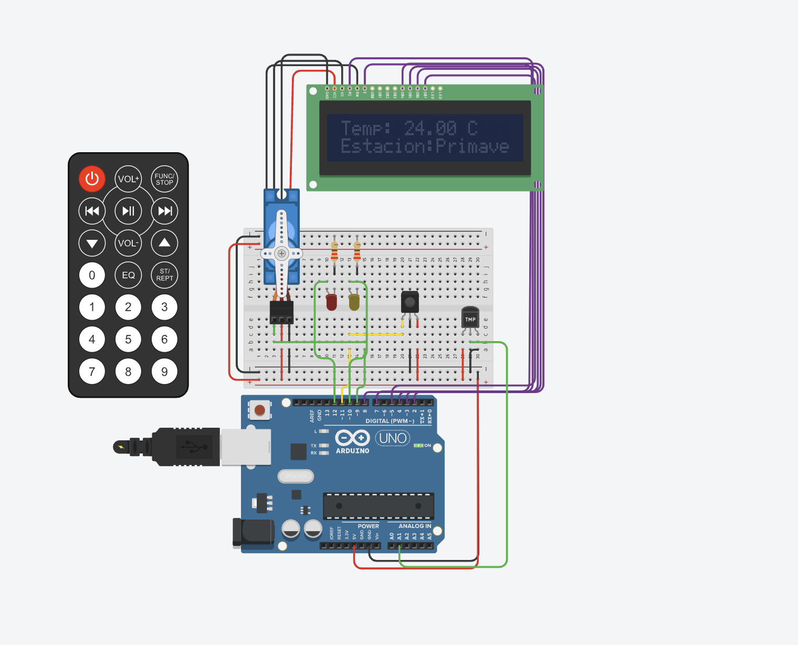

# _PROYECTO_
# __Sistema de incendio con Arduino__

## _Alumno: Quiroga Joaquín Ignacio_


## __Funcionalidad__. 

El sistema de incendio de arduino consta de una placa arduino,2 leds,un sensor de temperatura, un sensor IR y tambien las bibliotecas,"LiquidCrystal.h","Servo.h" y "Rremote.h" para la utilisacion del LCD 16x2, un servo motor, y el control remoto por IR.
El sistema de incendio detecta y muestra la temperatura que hay en el ambiente, tambien muestra que estacion del año es segun las temperaturas detectadas.Si la temperatura detectada es superior a 60 grados C, se activara la alarma de incendio moviendo el servo y titilando los leds rojos y amarillos en señal de emergencia y mostrando en el lcd "PELIGRO FUEGO"
  
### Funciones:

1. __Funcion: `increntar_decrementar`__

Esta funcion recibe dos parametro `numero` y `incre_decre`
`incre_decre` indica si se va a aumentar o decrementar `numero` y retorna `numero` sumado o restado.
```
int increntar_decrementar(int numero,int incre_decre)
{
  if (incre_decre == 0)
  {
    numero++;
  }
  else if (incre_decre == 1)
  {
    numero--;
  }
  return numero;
} 
```

2. __Funcion: `titilar_leds`__

Esta funcion recibe 3 parametros `led_1`,`led_2` y `delays`
`led_1` y `led_2` van a ser los 2 leds que se van a encender y apagar uno primero y despues el otro y `delays` es el delay que van a tener entre encendido y apagado.
```
void titilar_leds(int led_1,int led_2,int delays)
{
  digitalWrite(led_1,1);
  delay(delays);
  digitalWrite(led_1,LOW);
  delay(delays);
  digitalWrite(led_2,1);
  delay(delays);
  digitalWrite(led_2,LOW);
  delay(delays);
  
}
```

2. __Funcion: `retorna_estacion`__

Esta funcion recibe 1 solo parametro que es la `temp` que es la temperatura que va a utilizar para ver en que estacion y retornar esta. Si esta temperatura supera los 60 grados retornara FUEGO en señal de que las temperaturas son muy elevadas.
```
String retorna_estacion(int temp)
{
  String estacion;
  if(temp < 0)
  {
    estacion = "Invierno";
  }
  else if(temp > -1 && temp < 16){
    estacion = "Otono";
  }
  else if(temp > 14 && temp < 25)
  {
    estacion = "Primavera";
  }
  else if(temp > 24 && temp < 60)
  {
    estacion = "Verano";
  }
  else
  {
    estacion = "FUEGO";
  }
  return estacion;
}
```